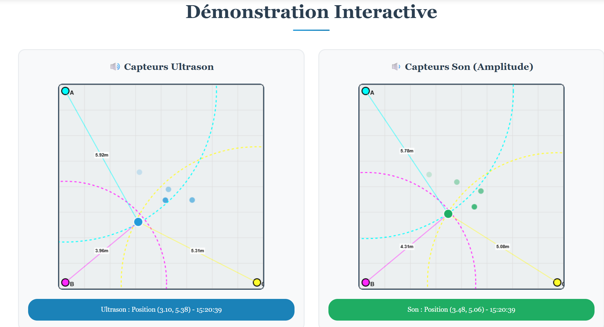

# 🛰️ SAé 24 — Suivi de position par capteurs

  
  
  
  

---

## 🎯 Objectif du projet

Ce projet a pour but de localiser en temps réel une source sonore ou ultrasonore dans une pièce de 8x8 mètres à l’aide de trois capteurs disposés en triangle.  
Les données sont :
- collectées via **Python** (script `service_enregistrement.py`) à l’aide de capteurs
- transmises via **MQTT**
- enregistrées en **MySQL**
- affichées dynamiquement via une interface **web** en **JavaScript / PHP / HTML5**

---

## 🧰 Fonctionnalités principales

- Visualisation **graphique** de la position estimée
- Carte d'**amplitude sonore**
- Carte de **trajectoire**
- Comparaison entre les méthodes ultrason / son
- Affichage des **rapports de mesure**
- Suppression et récupération des données via **API PHP**

---

## 🗂️ Arborescence du projet
├── index.html # Accueil général
├── admin.html # Gestion des données
├── monitoring.html # Monitoring en temps réel
├── trajectory.html # Carte de trajectoire
├── amplitude_map.html # Carte d’amplitude
├── comparison.html # Comparaison des méthodes
├── reports.html # Résumés de mesures
├── api_get_positions.php # API - Récupération JSON
├── api_clear_db.php # API - Suppression des enregistrements
├── service_enregistrement.py # Script Python MQTT → DB
├── simulateur.py # Simulation de données
├── database_setup.sql # Script SQL pour la BDD
├── visualisation.js # Affichage sur canvas
├── script.js # Scripts interactifs
├── styles.css / styles2.css # Feuilles de style

---

## 🧪 Lancer le projet

1. Démarrer le broker MQTT (Mosquitto recommandé)
2. Lancer le script d'enregistrement :
python3 service_enregistrement.py
3. Placer les fichiers web dans un serveur local (ex : XAMPP, Apache)
4. Configurer les accès MySQL dans db.php si nécessaire
5. Ouvrir index.html dans le navigateur

## 👥 Auteurs
Projet réalisé par :
**Peyre, Audoin, Roques, Zenden, Vogt**
Encadrants : **M. Roux & M. Massaoudi** — IUT de Blagnac

